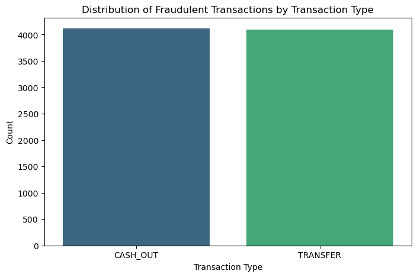
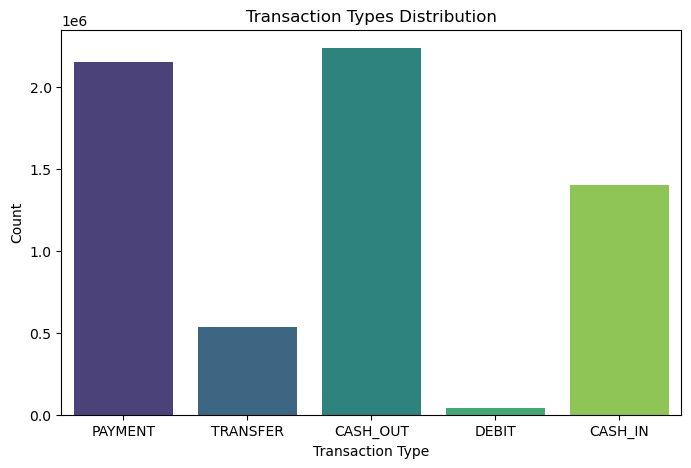
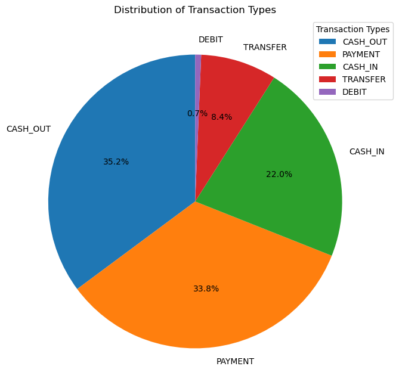
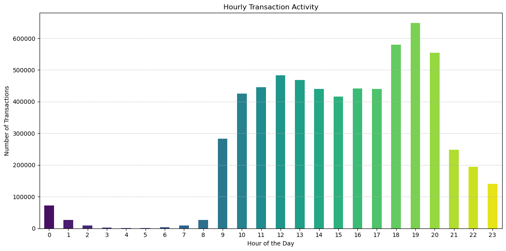
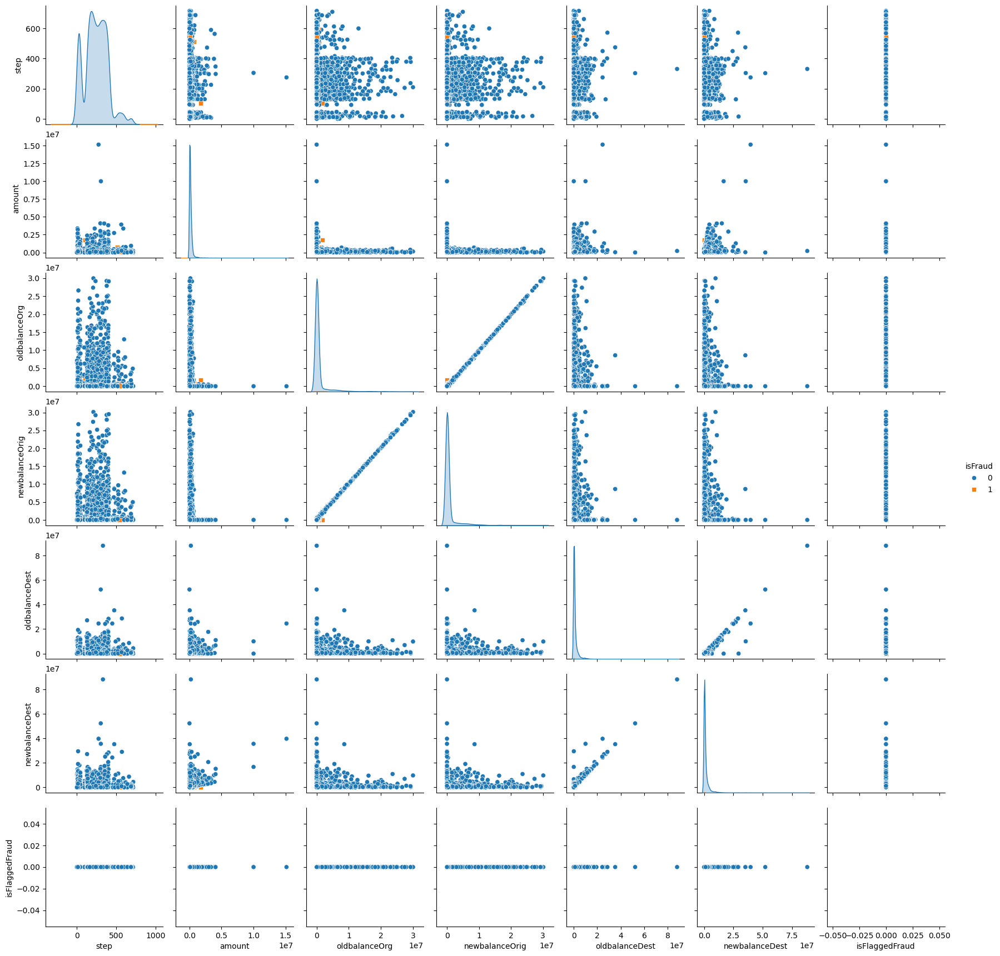
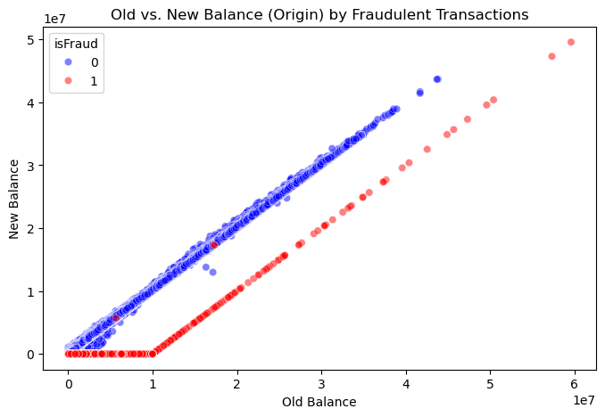
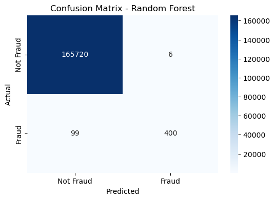
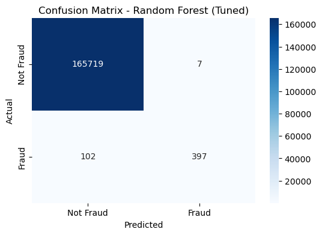

# Financial Fraud Detection Project

## Overview:

The purpose of this project is to detect fraudulent transactions using machine learning techniques. The dataset contains various transaction details, and the focus is on identifying fraud based on key features like transaction type, amount, and account balances.
Dataset:

* Source: Cleaned financial transaction dataset
* Key Features:
    * step: Represents time in hours from the start of the dataset
    * type: Transaction type (e.g., TRANSFER, CASH_OUT)
    * amount: Transaction amount
    * oldbalanceOrg: Balance before the transaction
    * newbalanceOrig: Balance after the transaction
    * oldbalanceDest: Destination account balance before the transaction
    * newbalanceDest: Destination account balance after the transaction
    * isFraud: Fraud label (1 = Fraudulent, 0 = Not Fraud)

## Data Preprocessing:

* Focused on TRANSFER and CASH_OUT transactions (where fraud is most common)
* Converted categorical variables to numerical format
* Scaled numerical features using StandardScaler
* Sampled 30% of the dataset for faster processing

## Exploratory Data Analysis (EDA):

* Visualizations:
    * Bar and Pie charts to transaction type distributions
    * Line plots of hourly transaction activity
    * Pair plots to analyze the relationship between numeric features
    * Scatter plots to examine balance changes
    * Confusion matrices for model evaluation

 

* Model Training & Evaluation
  * Models Used:
    * Random Forest Classifier: Used as a baseline model
    * Gradient Boosting Classifier: Used for improved predictive performance
    * Hyperparameter Tuning:
    * Applied RandomizedSearchCV to optimize model parameters
    * Selected best parameters for improved F1-score

<pre>
# Dictionary to store results
model_results = {}

# Train models with default parameters to find the best one
models = {
    "Logistic Regression": LogisticRegression(),
    "Naive Bayes": GaussianNB(),
    "kNN Classifier": KNeighborsClassifier(),
    "SVM Classifier": SVC(),
    "Random Forest": RandomForestClassifier(random_state=42),
    "Gradient Boosting": GradientBoostingClassifier(random_state=42)
}

print("\nTraining models with default parameters...\n")
for name, model in models.items():
    acc, f1 = train_evaluate_model(model, name)
    model_results[name] = {'Accuracy': acc, 'F1 Score': f1}

    # Find best model based on F1 Score
best_model_name = max(model_results, key=lambda k: model_results[k]['F1 Score'])
print(f"\nBest performing model: {best_model_name}")

# Define hyperparameter tuning for best model
param_grids = {
    "Logistic Regression": {'C': uniform(0.1, 10), 'solver': ['liblinear', 'saga'], 'max_iter': [100, 200]},
    "Naive Bayes": {'var_smoothing': np.logspace(0,-9, num=100)},
    "kNN Classifier": {'n_neighbors': randint(3, 20), 'weights': ['uniform', 'distance'], 'p': [1, 2]},
    "SVM Classifier": {'C': uniform(0.1, 10), 'kernel': ['linear', 'rbf'], 'gamma': ['scale', 'auto']},
    "Random Forest": {'n_estimators': randint(50, 200), 'max_depth': randint(3, 20), 
                      'min_samples_split': randint(2, 10), 'min_samples_leaf': randint(1, 10), 'bootstrap': [True, False]},
    "Gradient Boosting": {'n_estimators': randint(50, 200), 'learning_rate': uniform(0.01, 0.2),
                          'max_depth': randint(3, 20), 'min_samples_split': randint(2, 10), 'min_samples_leaf': randint(1, 10)}
} 
</pre>

* Performance Metrics:
    * Accuracy
    * Precision
    * Recall
    * F1-score
    * Confusion Matrix visualization

## Results

* The optimized Gradient Boosting Classifier achieved the best F1-score
* Important features influencing fraud detection include transaction amount, balance differences, and transaction type

 

<pre>
Random Forest Performance:
Accuracy: 0.9994
F1 Score: 0.8840
              precision    recall  f1-score   support

           0       1.00      1.00      1.00    165726
           1       0.99      0.80      0.88       499

    accuracy                           1.00    166225
   macro avg       0.99      0.90      0.94    166225
weighted avg       1.00      1.00      1.00    166225
</pre>

<pre>
Final Model Results:
Accuracy: 0.9993
F1 Score: 0.8793
</pre>

## Future Improvements

* Use deep learning to improve fraud detection.
* Detect fraud in real time with streaming data.
* Test different anomaly detection methods.

## How to Run

1. Install Python libaries (pandas, numpy, matplotlib, seaborn, sklearn, scipy etc)
2. Run the data preprocessing notebook to clean and prepare the dataset
3. Execute the model training notebook to train and evaluate fraud detection models